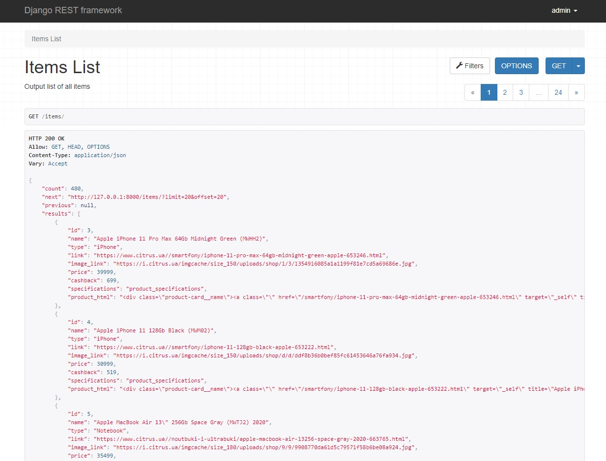

## Test task: Scraping citrus.ua and API with Django Rest Framework
Main web-scraping file webparser.py.
Information save in database PostgraseSQL using peeve.

#### Implement:
  1. used Django Rest Framework
  2. models: ProductItem
  3. scraping with HTMLSession, BeautifulSoup
  4. testing models, views, urls
  5. filtering by 'type', 'price', 'cashbak' using ```django-filter```
  
#### I couldn't connect web-scraping process with main loop of django because HTMLSession run oun Thread. Tried run with Celery and Redis but scraping process didn't start.
  
#### Urls:
1. main page with one button  ```/```
2. list of all scraping items ```items/```
3. list of iPhones ```items/phone```

4. list of notebooks ```items/phone```
```
    {
        "id": 1,
        "name": "Apple iPhone 11 Pro Max 64Gb Midnight Green (MWHH2)",
        "type": "iPhone",
        "link": "https://www.citrus.ua//smartfony/iphone-11-pro-max-64gb-midnight-green-apple-653246.html",
        "image_link": "https://i.citrus.ua/imgcache/size_180/uploads/shop/1/3/1354916085a1a1199f81e7cd5a69686e.jpg",
        "price": 39999,
        "cashback": 699,
        "specifications": "Материалы корпуса: Металл, Стекло; Влагозащита: IP68; Влагозащита: IP68; К....",
        "product_html": "<div class="product-card__name"><a class="" href="/smartfony/....>"
    },
```

### Running project

To get this project up and running you should start by having Python installed on your computer. It's advised you create a virtual environment to store your projects dependencies separately. You can install virtualenv with

```
pip install virtualenv
```

Clone or download this repository and open it in your editor of choice. In a terminal (mac/linux) or windows terminal, run the following command in the base directory of this project

```
virtualenv env
```

That will create a new folder `env` in your project directory. Next activate it with this command on mac/linux:

```
source env/bin/active
```
 or 
 ```
 env\Scripts\activate
```

Then install the project dependencies with

```
pip install -r requirements.txt
```

Migrate for creating all tables 

```
python manage.py migrate
```

Run file webparser.py for scraping information 

```
python webparser.py
```

Now you can run the project with this command

```
python manage.py runserver
```

